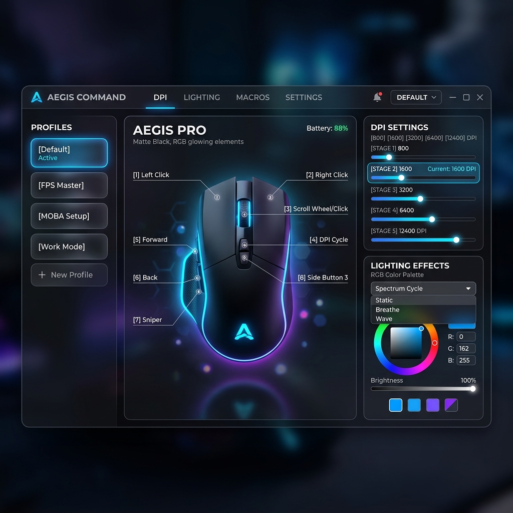

# EvoFox Ghost Air Linux Configuration Utility

A premium, web-based configuration utility for the **EvoFox Ghost Air gaming mouse** (`VID: 0x04D9, PID: 0xA09E`) on Linux. It allows you to customize button mappings, DPI stages, USB polling rates, and RGB lighting effects, and saves them directly to the mouse's onboard memory.



## Features

- **Profile Manager**: Create, rename, delete, and switch between multiple custom configuration profiles.
- **Interactive Button Remapping**: Rebind any of the 8 physical mouse buttons or scroll wheel directions to mouse clicks, multimedia commands, or custom keyboard keys.
- **DPI Configurator**: Toggle up to 8 DPI stages and adjust resolutions dynamically (200 to 12400 DPI) along with custom LED colors matching each stage.
- **RGB Lighting Controls**: Customize LED animation modes (Off, Static, Neon, Wave, Breathing, Yo-Yo, etc.), brightness intensities, and speed levels.
- **Performance Settings**: Configure pointer precision, double-click speeds, and polling rates (125Hz to 1000Hz).
- **Background Daemon**: Auto-starts via a standard systemd user service upon login.

---

## Installation

This utility supports all major Linux distributions. The installer automatically detects your package manager and sets up the required dependencies.

### 1. Run the Installer
Run the automated script to set up system dependencies, python packages, user space udev permissions, and the systemd daemon:

```bash
chmod +x install.sh
./install.sh
```

> **Note**: The installer will prompt for your `sudo` password to install the required system packages (`python3-venv`, `hidapi`) and set up the `/etc/udev/rules.d/` permissions. 

**IMPORTANT**: Once the script finishes successfully, **unplug and replug your mouse** so the system applies the newly installed udev permissions.

### 2. Configure Your Mouse
Open your web browser and navigate to:

```
http://localhost:18988
```

Select a profile, make adjustments, and click **Save & Apply**. Once saved, you can close the browser—the configuration is applied directly to the mouse's onboard memory and persists across devices.

---

## Service Management

The configuration service runs in the background as a systemd **user service** (meaning it does not require root permissions to run).

- **Check status**:
  ```bash
  systemctl --user status evofox-ghost-air.service
  ```
- **Stop service**:
  ```bash
  systemctl --user stop evofox-ghost-air.service
  ```
- **Restart service**:
  ```bash
  systemctl --user restart evofox-ghost-air.service
  ```
- **View logs**:
  ```bash
  journalctl --user -u evofox-ghost-air.service -f
  ```

---

## Technical Details

- **Configuration Storage**: User profiles are stored in a human-readable JSON format at `~/.config/evofox-ghost-air.json`.
- **System Permissions**: A custom udev rule `/etc/udev/rules.d/99-evofox-ghost-air.rules` is installed to grant read/write access to the mouse raw HID raw endpoints for all local users (`TAG+="uaccess"`).
- **Virtual Environment**: Python dependencies are installed in a local virtual environment at `~/.local/share/evofox-ghost-air/venv` to avoid system-level package conflicts (PEP 668).

---

## Troubleshooting

### Mouse Not Detected / "Disconnected"
1. Ensure the mouse is plugged in.
2. If the status says "Disconnected", ensure the udev rules have reloaded. You can force-reload them with:
   ```bash
   sudo udevadm control --reload-rules && sudo udevadm trigger
   ```
3. Unplug and replug the mouse.

### Service Fails to Start
If `systemctl --user status` shows failures, check the logs:
```bash
journalctl --user -u evofox-ghost-air.service -n 50
```
Ensure that no other process is holding port `18988`.
